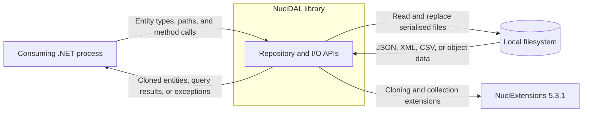
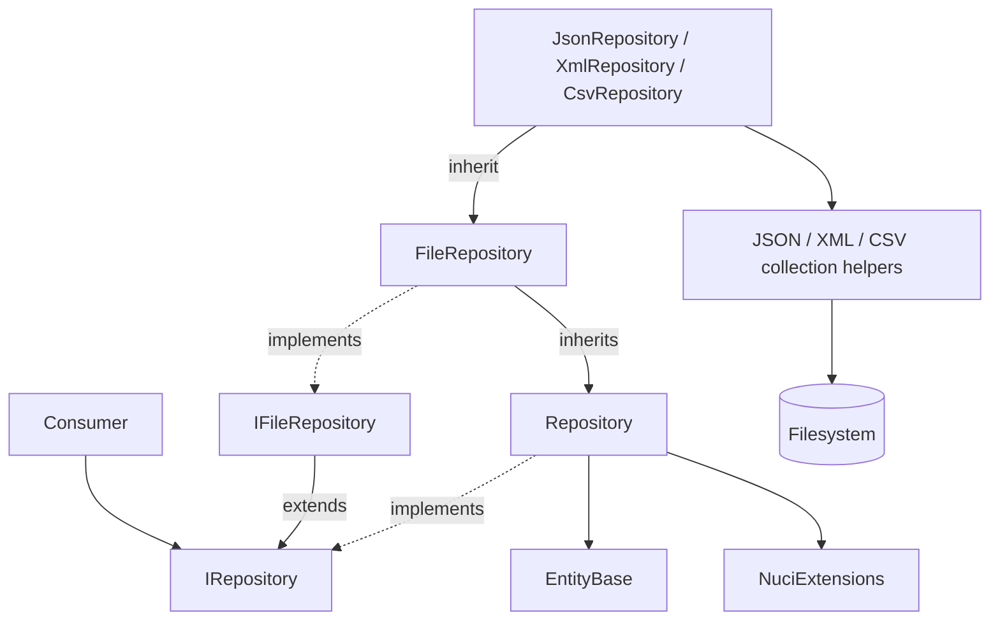
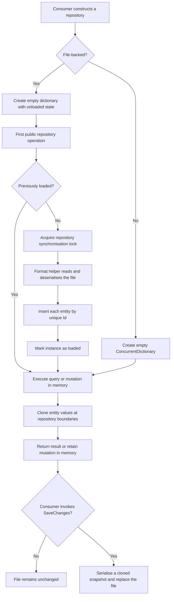
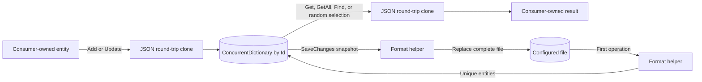
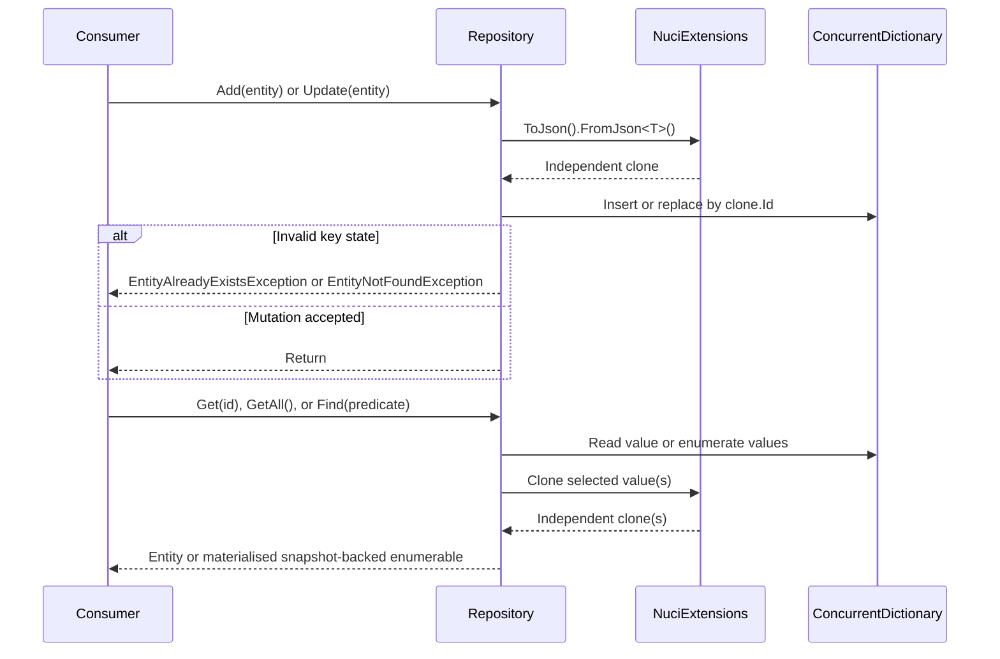
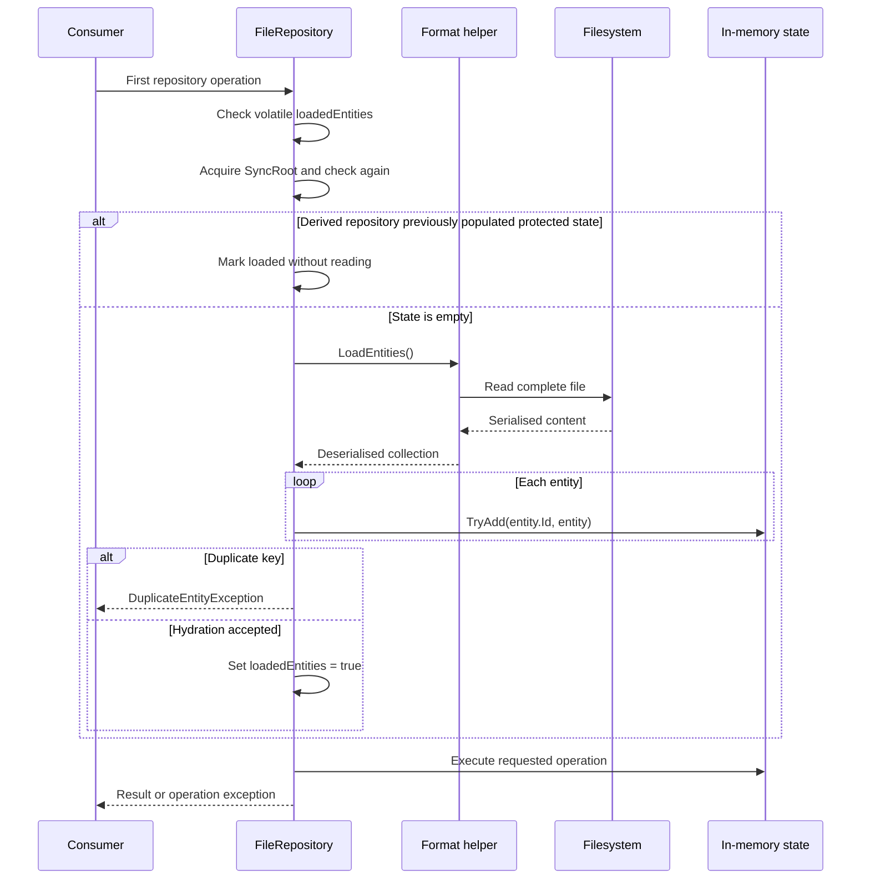
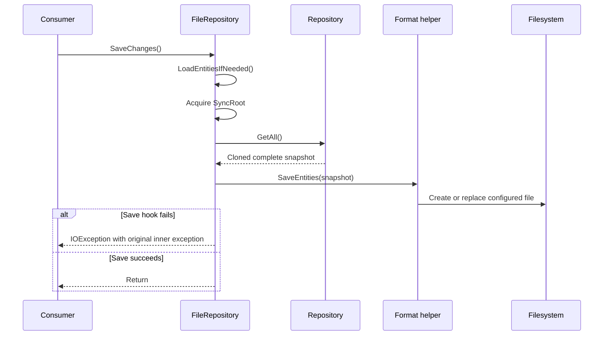
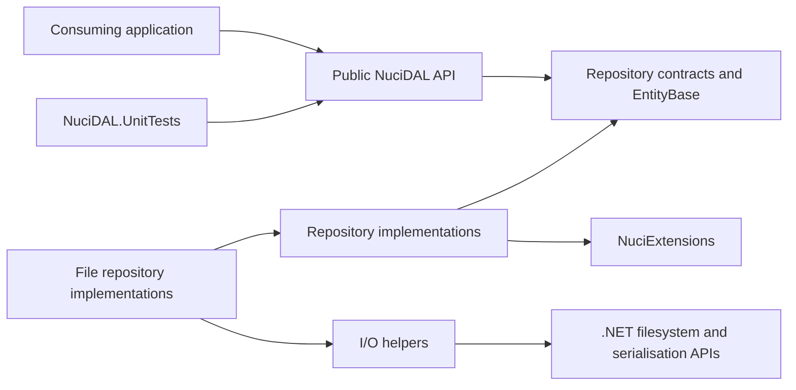

# NuciDAL Architecture

This document describes the verified current architecture of the NuciDAL .NET library. It covers the public repository and file I/O boundaries in this repository; consuming applications, their domain models beyond the required entity contract, and their deployment architecture remain external to this scope.

## 📑 Table of Contents

- [Table of Contents](#table-of-contents)
- [Purpose](#purpose)
- [System Context](#system-context)
- [Architectural Style](#architectural-style)
- [Runtime Flow](#runtime-flow)
- [Components](#components)
- [Architectural Areas](#architectural-areas)
  - [Data Objects](#data-objects)
  - [Repository Contracts and Implementations](#repository-contracts-and-implementations)
  - [File I/O](#file-io)
  - [Verification](#verification)
- [Data Architecture](#data-architecture)
- [Interfaces and Integrations](#interfaces-and-integrations)
- [Key Flows](#key-flows)
  - [Repository Query and Mutation](#repository-query-and-mutation)
  - [Lazy File Hydration](#lazy-file-hydration)
  - [Explicit File Persistence](#explicit-file-persistence)
- [File Format Semantics](#file-format-semantics)
- [Cross-Cutting Concerns](#cross-cutting-concerns)
  - [Security and Privacy](#security-and-privacy)
  - [Error Handling](#error-handling)
  - [Observability](#observability)
  - [Configuration](#configuration)
  - [Concurrency and Resource Use](#concurrency-and-resource-use)
- [Dependency Direction and Rules](#dependency-direction-and-rules)
- [External Dependencies](#external-dependencies)
- [Deployment and Operations](#deployment-and-operations)
- [Compatibility Contracts](#compatibility-contracts)
- [Testing and Verification](#testing-and-verification)
- [Design Constraints](#design-constraints)
- [Extension Points](#extension-points)
  - [Entity and Key Types](#entity-and-key-types)
  - [Repository Implementations](#repository-implementations)
  - [File Formats](#file-formats)
- [Architecture Decisions](#architecture-decisions)
- [Source Map](#source-map)
- [Related Documentation](#related-documentation)

## 🎯 Purpose

NuciDAL supplies generic repository contracts, an in-memory implementation, and JSON, XML, and CSV file-backed implementations for entities identified by generic keys. This document records the boundaries that contributors and consumers must preserve: clone-isolated repository state, lazy file hydration, explicit persistence, serialised format contracts, exception semantics, and dependency direction. It describes the library as implemented at version 3.2.0 and does not propose a target architecture.

## 🌐 System Context

NuciDAL is an embeddable .NET 10 class library. A consuming .NET process constructs repository or standalone I/O types, supplies entity types and file paths, invokes synchronous operations, and owns each instance's lifetime. The library has no executable entry point, remote service, database, authentication system, or configuration provider. File-backed types exchange plaintext serialised data with the local filesystem, while repository cloning and selected collection operations depend upon `NuciExtensions`.



The principal external boundaries are:
- **Consuming .NET process:** Selects concrete implementations, defines entity shapes, supplies paths and predicates, owns repository lifetimes, and decides when to persist file-backed mutations.
- **Local filesystem:** Stores JSON, XML, CSV, standalone object, or Windows-1252 text outputs. The host owns path validation, permissions, confidentiality, backup, and coordination with other processes.
- **NuciExtensions 5.3.1:** Supplies JSON round-trip cloning and collection utility extensions used inside repository operations; its runtime assembly is part of the library's dependency closure.

Entity values and file contents traverse a trust boundary into reflection, conversion, and serialisation APIs without domain validation. NuciDAL neither classifies sensitive data nor protects it at rest.

## 🏗️ Architectural Style

The implementation combines the Repository pattern with generic contracts, inheritance-based specialisation, and Template Method hooks for file formats. `Repository<TKey, TDataObject>` owns all query and mutation semantics. `FileRepository<TKey, TDataObject>` inherits those semantics and adds one-time hydration plus explicit persistence, while JSON, XML, and CSV repositories implement only the two format-specific load and save hooks. Clone-on-ingress and clone-on-egress isolate stored entities from references retained by consumers.

All production types compile into one assembly. The areas described below are namespace and responsibility boundaries rather than separately deployed layers.



The principal architecture boundaries are:
- **Public contracts:** `IRepository` and `IFileRepository` define consumer-visible operations independently of storage format.
- **Repository state and semantics:** `Repository` owns keyed storage, clone isolation, query snapshots, mutation conduct, and entity exceptions.
- **File lifecycle:** `FileRepository` owns lazy hydration, duplicate detection during hydration, and explicit save orchestration.
- **Format adapters:** Concrete file repositories and I/O helpers own serialisation, parsing, and filesystem access.
- **Entity model:** `EntityBase<TKey>` supplies identity plus reflection-based value equality and hashing; consumers own derived domain properties.

## 🔄 Runtime Flow



The principal runtime sequence is:
1. The consuming process constructs an in-memory or file-backed repository; construction itself performs no file I/O.
2. An in-memory repository starts with an empty `ConcurrentDictionary<TKey, TDataObject>`. A file repository defers hydration until its first repository operation, including `SaveChanges()`.
3. File hydration executes once per successfully loaded instance under `SyncRoot`. The helper deserialises the complete collection, and `FileRepository` rejects repeated keys with `DuplicateEntityException`.
4. Repository queries and mutations execute synchronously upon in-memory state. Entities entering through `Add` or `Update`, and entities exiting through query methods, pass through a JSON round-trip clone.
5. File-backed mutations affect only the instance's memory until the consumer invokes `SaveChanges()`.
6. `SaveChanges()` serialises the complete cloned repository snapshot and replaces the configured file while holding the repository's synchronisation lock.

## 🧩 Components

| Component | Responsibility | Principal Dependencies | Lifetime or Ownership |
|-----------|----------------|------------------------|-----------------------|
| `EntityBase<TKey>` and `EntityBase` | Supply generic or string identity, reflection-based equality and hashing, and JSON `ToString()` output | Reflection, `NuciExtensions` | Base types are library-owned; derived entity types and original instances are consumer-owned |
| `IRepository<TKey, TDataObject>` | Define keyed CRUD, lookup, count, random selection, and predicate query contracts | `EntityBase<TKey>` | Stateless public contract implemented by a consumer-selected repository |
| `IFileRepository<TKey, TDataObject>` | Extend repository operations with explicit `SaveChanges()` | `IRepository<TKey, TDataObject>` | Stateless public contract |
| `Repository<TKey, TDataObject>` | Own clone-isolated entities, keyed operations, snapshots, and mutation locking | `ConcurrentDictionary`, LINQ, `NuciExtensions` | One independent state aggregate per repository instance |
| `FileRepository<TKey, TDataObject>` | Coordinate lazy hydration, duplicate-key validation, and complete-file persistence | `Repository`, format hooks, filesystem exceptions | One loaded-state cache per file repository instance |
| `JsonRepository`, `XmlRepository`, and `CsvRepository` | Bind file lifecycle hooks to the corresponding collection helper | `FileRepository`, I/O helpers | Each instance owns one helper configured with its constructor path |
| Collection and object I/O helpers | Read and write JSON, XML, or CSV representations | .NET serialisation, reflection, conversion, and filesystem APIs | Stateless apart from path, type, options, or separator configuration |
| Repository exceptions | Communicate duplicate, existing, or missing entity conditions with entity identifier and type context | `System.Exception` | Allocated per failed operation |
| `Windows1252File` | Write text with Windows-1252 encoding, synchronously or asynchronously | .NET encoding and filesystem APIs | Static utility; no repository association |

## 🗂️ Architectural Areas

### Data Objects

Paths:
- [NuciDAL/DataObjects/EntityBase.cs](NuciDAL/DataObjects/EntityBase.cs)

Responsibilities:
- Define the minimum identity contract for repository entities.
- Implement value equality and hash generation across all public instance properties.
- Provide the string-key convenience base class.

Boundary rules:
- Every repository entity derives from `EntityBase<TKey>`; `EntityBase` fixes `TKey` to `string`.
- Consumers own domain validation and derived properties.
- Equality and hashing depend upon every public property exposed by the runtime type.

### Repository Contracts and Implementations

Paths:
- [NuciDAL/Repositories](NuciDAL/Repositories)

Responsibilities:
- Define storage-independent repository contracts.
- Own in-memory entity state, clone boundaries, queries, and mutations.
- Add lazy file lifecycle orchestration and storage-specific adapters.
- Translate repository state conflicts into typed entity exceptions.

Boundary rules:
- Base repository semantics do not depend upon a file format.
- File repositories reuse base query and mutation semantics rather than duplicating them.
- Concrete format repositories implement `FetchEntitiesFromFile()` and `PerformFileSave()` only.

### File I/O

Paths:
- [NuciDAL/IO](NuciDAL/IO)

Responsibilities:
- Convert complete entity collections or individual objects between CLR values and file representations.
- Own file opening, replacement, disposal, parsing, formatting, and encoding details.

Boundary rules:
- I/O helpers do not depend upon repository contracts or implementations.
- Collection helpers expose raw serialisation and filesystem exceptions; repository-level translation occurs only where `FileRepository` explicitly implements it.
- Standalone object and Windows-1252 helpers are public utilities but do not participate in repository runtime flows.

### Verification

Paths:
- [NuciDAL.UnitTests](NuciDAL.UnitTests)
- [.github/workflows/dotnet.yml](.github/workflows/dotnet.yml)

Responsibilities:
- Verify entity equality, in-memory repository semantics, clone isolation, query snapshots, and entity exception metadata.
- Restore, compile, and execute the solution on .NET 10 for pushes and pull requests to `master`.

Boundary rules:
- Tests reference the production project directly.
- No current test invokes a file repository, collection helper, object helper, or Windows-1252 utility.

## 💾 Data Architecture

Each repository instance owns one `ConcurrentDictionary<TKey, TDataObject>` and enforces one value per key. `Add` rejects an existing key, `Update` requires an existing key, `TryUpdate` performs an upsert, and removals delete the key. The dictionary is the authoritative state for the lifetime of an in-memory instance and, after hydration, for the lifetime of a file-backed instance.

Repository ingress and egress use `NuciExtensions` JSON serialisation followed by deserialisation. Consequently, callers do not receive references to stored values, but repository-compatible entity graphs must also be compatible with that cloning mechanism. `GetAll()` materialises cloned values; `Find()` applies its predicate lazily to that materialised collection, so subsequent repository mutations do not alter the returned collection.

File repositories load a complete collection on first use and retain it indefinitely. They do not monitor external file modifications. `SaveChanges()` emits the complete current collection; there is no change set, schema version, migration mechanism, journal, or transaction across files.



| Data or Store | Owner | Representation and Storage | Lifecycle or Consistency |
|---------------|-------|----------------------------|--------------------------|
| Repository entity | `Repository<TKey, TDataObject>` | Consumer-defined class derived from `EntityBase<TKey>` | Cloned on `Add`, `Update`, `TryUpdate`, and all entity-returning queries |
| Repository state | Repository instance | `ConcurrentDictionary<TKey, TDataObject>` in process memory | Independent per instance; retained until removal or instance disposal by the consumer |
| JSON collection | `JsonFileCollection<T>` | Indented JSON array with camel-case property names | Loaded once by a repository; complete file replaced on save |
| XML collection | `XmlFileCollection<T>` | `XmlSerializer` representation configured for `List<T>` | Loaded once by a repository; complete file replaced on save |
| CSV collection | `CsvFile<T>` | Delimiter-separated reflected public property values, comma-delimited through `CsvRepository` | Missing file produces an empty collection; complete file replaced on save |
| Standalone JSON or XML object | `JsonFileObject<T>` or `XmlFileObject<T>` | One serialised object at a caller-supplied path | Direct read or write per call; outside repository state |

## 🔌 Interfaces and Integrations

| Interface or Integration | Direction | Contract | Owner | Failure Semantics |
|--------------------------|-----------|----------|-------|-------------------|
| `IRepository<TKey, TDataObject>` | Inbound | Synchronous keyed CRUD and LINQ-to-Objects predicate queries for `EntityBase<TKey>` types | Repository layer | Strict methods throw typed entity exceptions; `TryGet` variants return `null`, and `TryAdd` or `TryRemove` silently retain state when their condition is not met |
| `IFileRepository<TKey, TDataObject>` | Inbound | All repository operations plus explicit synchronous `SaveChanges()` | File repository layer | Initial hydration failures propagate in their original form; save-hook failures are wrapped in `IOException` |
| JSON collection file | Bidirectional | `System.Text.Json` collection with camel-case output names and indentation | `JsonFileCollection<T>` | Missing, inaccessible, malformed, or incompatible input exceptions propagate during first access |
| XML collection file | Bidirectional | `XmlSerializer` payload configured as `List<T>` | `XmlFileCollection<T>` | Missing, inaccessible, malformed, or incompatible input exceptions propagate during first access |
| CSV collection file | Bidirectional | Public reflected properties separated by comma; trimmed lines commencing with `#` are comments | `CsvFile<T>` | Missing input is an empty collection; parse failures become `SerializationException` with a line number |
| Standalone JSON/XML object files | Bidirectional | Direct generic `Read` and `Write` utility methods | Object I/O helpers | Serialisation and filesystem exceptions propagate directly |
| Windows-1252 text file | Outbound | Synchronous or cancellable asynchronous complete-file byte write | `Windows1252File` | Encoding initialisation and filesystem exceptions propagate directly |
| `NuciExtensions` | Outbound in-process | `ToJson`, `FromJson`, `NotEquals`, and random collection selection extensions | Repository and data object implementations | Dependency exceptions are not translated by the in-memory repository |

## 🔀 Key Flows

### Repository Query and Mutation



Writes execute under `SyncRoot`. `Add` and `Update` clone before validating key state; failed cloning therefore precedes repository-specific conflict translation. `TryAdd` ignores an existing key, while `TryUpdate` assigns by key and therefore inserts when absent. Reads return clones. `Find()` captures cloned values when called, then defers predicate evaluation over that captured collection.

### Lazy File Hydration



Every public file-repository operation reaches `LoadEntitiesIfNeeded()` directly or through a virtual query method. Construction never opens the file. Successful hydration is cached per instance. The protected non-empty-state branch supports derived repositories that populate `Entities` before first use; public `Add` cannot activate that branch because it requests hydration first.

### Explicit File Persistence



Hydration occurs before the save exception wrapper. A missing or malformed JSON/XML input can therefore terminate `SaveChanges()` with its original load exception, whereas failures raised by the format save hook become `IOException`. No retry, temporary-file exchange, rollback, or conflict detection is present.

## ⚙️ File Format Semantics

| Format or Utility | Verified Representation | Compatibility-Sensitive Detail |
|-------------------|-------------------------|--------------------------------|
| JSON collections | `System.Text.Json` serialised `IEnumerable<T>` with camel-case naming and indentation | The repository expects a collection payload; an absent file is not interpreted as an empty store |
| XML collections | `XmlSerializer` configured for `List<T>` | XML element names and compatible constructors/properties derive from CLR types; an absent file is not interpreted as an empty store |
| CSV collections | One entity per line, `Split(FieldSeparator)` parsing, `Convert.ChangeType`, and no quoting or escaping | `CsvRepository` uses comma; `CsvFile<T>` can receive another separator. Reflection returns the columns, then the final reflected property is shifted to the first position |
| JSON objects | One generic object with camel-case, case-insensitive input, and indented output | This helper is independent of `JsonRepository`, which uses separate collection options |
| XML objects | One generic object through `XmlSerializer(typeof(T))` | This helper is independent of `XmlRepository`, which configures a collection serializer |
| Windows-1252 text | Complete text encoded and written as bytes | Runtime availability of the named code page is not configured by this library |

CSV comments are accepted only while loading and are not preserved by save. Because fields are neither quoted nor escaped, values containing the separator or line terminators do not round-trip as one field. Adding, eliminating, or reordering public entity properties can alter the persisted column contract.

## 🧵 Cross-Cutting Concerns

### Security and Privacy

NuciDAL performs no authentication, authorisation, path restriction, content sanitisation, encryption, or data classification. Repository entity values, predicates, paths, and file contents originate beyond the library trust boundary. The consuming process must validate domain values and paths, restrict filesystem permissions, coordinate access, and apply encryption or retention controls when data is sensitive. JSON, XML, and CSV persistence is plaintext by default. Exception metadata contains entity identifiers and type names, so consumers must evaluate those values before recording or exposing exceptions.

### Error Handling

The in-memory repository translates key-state conflicts into `EntityAlreadyExistsException` and `EntityNotFoundException`; `GetFirst` also uses `EntityNotFoundException` when no predicate match exists. `DuplicateEntityException` identifies repeated keys discovered during file hydration. All three derive from `EntityException`, which records `EntityId` and `EntityTypeName`.

`TryGet` and `TryGetFirst` use `null` for absence. `TryAdd` ignores duplicates, `TryRemove` ignores absent keys, and `TryUpdate` is an upsert rather than a no-op when absent. Exceptions from cloning, predicates, random selection, null values, or invalid keys are not translated. File load exceptions propagate directly. Only exceptions raised during `PerformFileSave()` are wrapped as `IOException("Cannot save the changes", innerException)`. There is no retry or degradation policy beyond CSV's missing-file-to-empty-collection rule.

### Observability

The library emits no logs, metrics, traces, health signals, or audit events. Return values and exceptions are its only diagnostic interface. Correlation, redaction, and operational recording belong to the consuming process.

### Configuration

| Configuration Area | Source | Responsibility | Override or Secret Policy |
|--------------------|--------|----------------|---------------------------|
| Repository file path | Concrete repository constructor | Selects the single collection file associated with an instance | No internal precedence, path normalisation, or secret source |
| CSV field separator | `CsvFile<T>` constructor | Selects the delimiter for the standalone helper | `CsvRepository` exposes only its file-name constructor and therefore uses comma |
| JSON collection options | Private `JsonSerializerOptions` in `JsonFileCollection<T>` | Fixes camel-case property naming and indented output | No consumer override |
| JSON object options | Private `JsonSerializerOptions` in `JsonFileObject<T>` | Adds case-insensitive input to the standalone object contract | No consumer override |
| XML shape | Runtime generic type passed to `XmlSerializer` | Derives element and property representation | Controlled through serialisable CLR type metadata, not repository configuration |

### Concurrency and Resource Use

Within one repository instance, `ConcurrentDictionary` protects individual dictionary operations and `SyncRoot` serialises writes. File hydration uses double-checked locking with a volatile flag; `SaveChanges()` holds the same lock while obtaining a cloned snapshot and writing it. Reads do not acquire that lock, so concurrent enumeration is safe at the collection level but does not constitute a transactional point-in-time view. Stored entities are replaced rather than mutated through the public API, which limits shared-object mutation after cloning.

Distinct repository instances, processes, or direct helper calls have no shared synchronisation. Two instances directed to one path can retain divergent snapshots and overwrite one another. Collection I/O reads or writes complete files synchronously, and repositories retain complete datasets in memory without paging, eviction, or size limits. Streams and readers are scoped with `using`; repository types own no persistent handle and implement no disposal contract. Only `Windows1252File.WriteAllTextAsync` supplies asynchronous I/O and cancellation.

## 🧭 Dependency Direction and Rules

Consumers may depend upon public contracts or concrete repository and I/O types. Production dependencies proceed from repository implementations towards entity contracts, `NuciExtensions`, and format helpers; format helpers depend only upon .NET APIs and never upon repositories. The test project depends upon the production project, and the production project has no dependency upon tests or a consuming host.



The principal dependency rules are:
- Consumers can substitute implementations at `IRepository` or `IFileRepository` boundaries; NuciDAL contains no dependency-injection registration or composition root.
- `Repository<TKey, TDataObject>` owns storage semantics and must remain independent of file formats.
- `FileRepository<TKey, TDataObject>` can depend upon base repository semantics, but base repositories do not depend upon file lifecycle concerns.
- Format repositories delegate serialisation and filesystem access to I/O helpers.
- I/O helpers do not call repository APIs or own repository state.
- Consumer domain types depend upon `EntityBase<TKey>`; the library does not depend upon a consumer domain assembly.
- Tests can depend upon production code; production code cannot depend upon test fixtures or test packages.

## 📦 External Dependencies

| Dependency | Responsibility | Integration Boundary | Architectural Consequence |
|------------|----------------|----------------------|---------------------------|
| `.NET 10.0` | Supplies the runtime, generic collections, reflection, file APIs, JSON, XML, encoding, and concurrency primitives | Entire production assembly | The NuGet package has one target framework and requires a compatible .NET 10 consumer |
| `NuciExtensions 5.3.1` | Supplies JSON conversion, inequality, and random collection extensions | `EntityBase` and `Repository` | Entity cloning and selected semantics are coupled to this package's extension contracts |
| `NUnit 4.6.1` | Supplies unit-test declarations and assertions | `NuciDAL.UnitTests` only | No production runtime dependency |
| `.NET test toolchain` | Supplies `Microsoft.NET.Test.Sdk 18.8.0`, `NUnit3TestAdapter 6.2.0`, and `coverlet.collector 10.0.1` | Test execution and optional coverage collection | Test packages remain private to the non-packable test project |

## 🚀 Deployment and Operations

The deployment unit is the `NuciDAL` NuGet library, currently version 3.2.0 and targeted exclusively at `net10.0`. It executes within the consuming process and creates no service, worker, port, or background thread. A consumer can construct multiple repository instances, each with independent memory and lazy-load state.

File-backed deployment requires a path accessible to the host process. JSON and XML files must exist and be readable before the first repository operation; CSV can commence from an absent file. The parent directory must exist for save operations. The caller owns final `SaveChanges()` timing because repository disposal and process shutdown do not persist pending mutations automatically.

| Concern | Current Design | Architectural Consequence |
|---------|----------------|---------------------------|
| Process topology | In-process library within one consumer | Availability, startup, shutdown, and recovery inherit the host's topology |
| Persistent state | Optional single JSON, XML, or CSV file per concrete repository instance | Host owns paths, permissions, backup, and external access coordination |
| State loading | Complete lazy hydration cached for the instance lifetime | First use incurs I/O; external modifications are not observed afterwards |
| State saving | Synchronous complete-file create or replacement | Cost increases with collection size; interruption can leave an incomplete file because no atomic exchange or journal exists |
| Scaling | Complete per-instance in-memory copy with no cross-instance coordination | Horizontal or multi-process use can produce stale reads and last-writer replacement |
| Recovery | In-memory state remains after a save exception, but no automatic retry or rollback exists | Caller decides whether and when to retry and must verify file integrity after partial I/O failure |
| Packaging | `dotnet pack` produces one .NET 10 NuGet package | Consumers targeting earlier frameworks cannot reference this release directly |

## 🛡️ Compatibility Contracts

| Contract | Owner | Invariant | Verification | Change Policy |
|----------|-------|-----------|--------------|---------------|
| Repository public API | Repository contracts and public implementations | Generic constraints, method signatures, strict versus `Try*` semantics, and clone-isolated results remain consumer-visible | In-memory repository unit tests and compilation of consumers | Treat signature or semantic modifications as compatibility-sensitive public API changes |
| Entity identity | `EntityBase<TKey>` and repository state | `Id` supplies the dictionary key; derived types expose serialisable public properties | Entity and repository unit tests | Key equality or identity semantic modifications require consumer and persisted-data evaluation |
| Entity equality and hashing | `EntityBase<TKey>` | Runtime types must correspond and every public instance property participates | `EntityBaseTests` | Public property modifications can alter equality and hash results |
| File lifecycle | `FileRepository<TKey, TDataObject>` | Construction is I/O-free, first use hydrates once, mutations remain in memory, and `SaveChanges()` emits the complete state | Source inspection; no current file-repository integration tests | Preserve ordering or document and test an intentional lifecycle migration |
| Entity exceptions | Repository layer | Duplicate, existing, and missing conditions expose typed exceptions with identifier and type metadata | Dedicated exception tests and repository tests | Preserve types and metadata when revising messages or translation boundaries |
| JSON collection | `JsonFileCollection<T>` | Collection payload, camel-case output property names, and indented output | No current persistence tests | Format modifications require round-trip fixtures or a migration strategy |
| XML collection | `XmlFileCollection<T>` | `XmlSerializer` representation configured for `List<T>` | No current persistence tests | CLR type or serializer-shape modifications require persisted-file compatibility evaluation |
| CSV collection | `CsvFile<T>` | Separator-based unescaped fields in reflected property order with the final property shifted first | No current persistence tests | Property or ordering modifications can be data-breaking and require explicit migration |
| Target framework | Project manifest | Production and test projects target `net10.0` | Solution compilation in CI | Framework modifications alter consumer compatibility and require package validation |

## ✅ Testing and Verification

The `NuciDAL.UnitTests` NUnit project verifies reflection-based entity equality and hashes, repository add/get/find/update/remove/count/contains operations, clone isolation, snapshot conduct, integer-key entity equality, and entity exception constructors and metadata. CI restores, compiles, and tests the solution on Ubuntu with .NET 10 for pushes and pull requests to `master`.

Material gaps remain. No current automated test exercises `FileRepository`, JSON/XML/CSV collection or object helpers, `SaveChanges()`, missing or malformed files, duplicate keys during hydration, filesystem failures, Windows-1252 encoding, concurrent operations, cross-instance access, or package consumption. Repository operations with a non-string key are not covered even though integer-key entity equality is covered. There are no benchmarks or explicit capacity checks.

Execute the principal automated verification with:

```bash
dotnet test NuciDAL.slnx
```

## ⚠️ Design Constraints

- **Embeddable library boundary:** NuciDAL has no host, composition root, automatic repository lifetime, or shutdown hook; each consumer must supply these concerns.
- **Complete in-memory state:** Every repository retains all entities, and collection queries and saves clone complete selections; capacity is bounded by host memory and synchronous serialisation cost.
- **JSON-dependent cloning:** All repository entity types must round-trip through the `NuciExtensions` JSON contract even when the persistence format is XML, CSV, or memory-only.
- **Explicit persistence:** File-backed mutation is not durable until `SaveChanges()` succeeds, and no dirty-state indicator or automatic flush exists.
- **One-time hydration:** A file repository does not observe later external file modifications and offers no public reload operation.
- **Format asymmetry:** Missing JSON and XML files fail on first use, while a missing CSV file represents an empty collection.
- **Non-atomic complete-file save:** Saves have no temporary-file exchange, transaction, journal, backup, or multi-file coordination.
- **CSV schema fragility:** Reflection order, property additions, delimiters, line terminators, and conversion compatibility affect round trips; quoting and escaping are absent.
- **Partial duplicate hydration:** If duplicate identifiers are discovered after earlier entities were inserted, the load fails with partial in-memory state. A subsequent attempt observes non-empty protected state and marks it loaded without rereading the file.
- **Per-instance synchronisation:** In-process coordination applies only to one repository instance; multiple instances or processes can overwrite divergent file snapshots.
- **Synchronous repository API:** Repository and collection I/O operations provide no asynchronous or cancellable contract.
- **Single target framework:** The package targets only .NET 10 and provides no .NET Standard or earlier .NET asset.

## 🔧 Extension Points

### Entity and Key Types

1. Derive a domain entity from `EntityBase<TKey>`, or from `EntityBase` for a string identifier.
2. Expose the public properties required by repository cloning and the selected persistence serializer.
3. Add equality, cloning, key, and format round-trip verification appropriate to the entity.

The key must provide dictionary-compatible equality and hashing. Public entity properties participate in `EntityBase` equality and hashing, and repository use additionally requires compatibility with JSON round-trip cloning.

### Repository Implementations

1. Implement `IRepository<TKey, TDataObject>` directly or inherit `Repository<TKey, TDataObject>` when its storage and clone semantics apply.
2. Select the implementation in the consuming application's composition root; NuciDAL performs no registration.
3. Add contract tests for strict and `Try*` methods, clone isolation, query snapshots, and concurrency relevant to the implementation.

A substitute exposed as `IRepository` must preserve the consumer-visible identity and failure semantics upon which its caller relies. Persistence-specific implementations exposed as `IFileRepository` must additionally define explicit save conduct.

### File Formats

1. Derive from `FileRepository<TKey, TDataObject>` and implement `FetchEntitiesFromFile()` plus `PerformFileSave()`.
2. Construct the adapter with its path or external resource contract in the consuming composition root.
3. Add hydration, duplicate-key, round-trip, missing-input, malformed-input, and save-failure verification.

The format adapter must return entities with unique keys, accept complete cloned snapshots during save, and preserve the base class ordering of lazy hydration before repository operations. Any retry, atomicity, or remote-resource semantics remain the adapter's responsibility unless the base contract is intentionally revised.

## 📝 Architecture Decisions

| Decision | Rationale | Consequence | Record |
|----------|-----------|-------------|--------|
| Expose generic repository contracts with string-key convenience types | One contract supports multiple identifier types while retaining concise common usage | Consumers can depend upon abstractions, but entity types must inherit the supplied base | Documented here |
| Isolate stored values through JSON round-trip cloning | One generic mechanism creates independent entity graphs without per-entity copy implementations | Every repository operation incurs serialisation cost and every entity must satisfy the JSON clone contract | Documented here |
| Centralise semantics in `Repository` and specialise persistence through `FileRepository` hooks | Query and mutation conduct remains identical across in-memory and file-backed implementations | Format adapters inherit lifecycle and clone semantics from the base hierarchy | Documented here |
| Hydrate lazily and persist explicitly | Construction performs no I/O, and the consumer controls when complete-file writes occur | First use can fail during load, and unsaved mutations are process-local | Documented here |
| Combine `ConcurrentDictionary` with one mutation and persistence lock | Individual reads use concurrent collection operations while compound writes and saves are serialised per instance | Cross-instance coordination and transactional snapshots are outside the implementation | Documented here |
| Maintain separate JSON, XML, and CSV helpers | Each serializer and parser remains local to its format adapter | Persisted representations have distinct missing-file, schema, and error semantics | Documented here |

## 🗺️ Source Map

| Area | Path |
|------|------|
| Solution composition | [NuciDAL.slnx](NuciDAL.slnx) |
| Production project and package metadata | [NuciDAL/NuciDAL.csproj](NuciDAL/NuciDAL.csproj) |
| Entity identity and value semantics | [NuciDAL/DataObjects/EntityBase.cs](NuciDAL/DataObjects/EntityBase.cs) |
| Repository contracts | [NuciDAL/Repositories/IRepository.cs](NuciDAL/Repositories/IRepository.cs), [NuciDAL/Repositories/IFileRepository.cs](NuciDAL/Repositories/IFileRepository.cs) |
| In-memory repository | [NuciDAL/Repositories/Repository.cs](NuciDAL/Repositories/Repository.cs) |
| File lifecycle base | [NuciDAL/Repositories/FileRepository.cs](NuciDAL/Repositories/FileRepository.cs) |
| Format repositories | [NuciDAL/Repositories/JsonRepository.cs](NuciDAL/Repositories/JsonRepository.cs), [NuciDAL/Repositories/XmlRepository.cs](NuciDAL/Repositories/XmlRepository.cs), [NuciDAL/Repositories/CsvRepository.cs](NuciDAL/Repositories/CsvRepository.cs) |
| I/O helpers | [NuciDAL/IO](NuciDAL/IO) |
| Repository exceptions | [NuciDAL/Repositories/EntityException.cs](NuciDAL/Repositories/EntityException.cs), [NuciDAL/Repositories/EntityAlreadyExistsException.cs](NuciDAL/Repositories/EntityAlreadyExistsException.cs), [NuciDAL/Repositories/EntityNotFoundException.cs](NuciDAL/Repositories/EntityNotFoundException.cs), [NuciDAL/Repositories/DuplicateEntityException.cs](NuciDAL/Repositories/DuplicateEntityException.cs) |
| Unit tests | [NuciDAL.UnitTests](NuciDAL.UnitTests) |
| Continuous integration | [.github/workflows/dotnet.yml](.github/workflows/dotnet.yml) |

## 📚 Related Documentation

- [README.md](README.md) describes capabilities, consumer usage, installation, development commands, package production, and the repository structure.
- [LICENSE](LICENSE) defines the GPL-3.0-or-later distribution terms; it does not define runtime architecture.